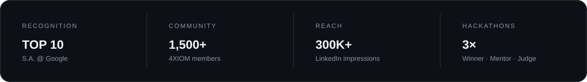

  

 

  

 

 

<h2 align="center">◈ ABOUT ME</h2>

<table align="center" width="92%">
<tr>
<td width="65%" valign="middle">

<h3>Hey there, I'm Parag Chaudhary 👋</h3>

I'm a <b>builder, speaker, community builder and designer</b> working at the intersection of technology, people and experiences.

I turn ideas into <b>products, communities and opportunities</b> — from AI-powered applications and full-stack experiments to student ecosystems, hackathons and technical events.

Currently building, learning and shipping across <b>AI, full-stack development, systems, design and community-led technology</b>.

 

</td>
<td width="35%" align="center">

  

</td>
</tr>
</table>

 

<h2 align="center">◈ WHAT I BUILD</h2>

<table width="92%"><tr>
<td align="center" width="25%"><h3>⚡ PRODUCTS</h3>
Modern web apps, AI tools and experiments.
</td>
<td align="center" width="25%"><h3>◉ COMMUNITIES</h3>
Student ecosystems, partnerships and events.
</td>
<td align="center" width="25%"><h3>✦ EXPERIENCES</h3>
Hackathons, workshops, speaking and design.
</td>
<td align="center" width="25%"><h3>♢ PEOPLE</h3>
Mentoring developers and student builders.
</td>
</tr></table>

 

<h2 align="center">◈ SELECTED WORK</h2>

<table width="92%">
<tr>
<td width="50%" valign="top"><h3>🚆 TrackSync AI</h3>
AI-powered block planning for railway operations, combining structured data processing with optimization.
</td>
<td width="50%" valign="top"><h3>🛡️ TFORCE LABS</h3>
A cybersecurity investigation training platform built around realistic law-enforcement workflows.
</td>
</tr>
<tr>
<td width="50%" valign="top"><h3>🌱 EcoMetrix</h3>
An AI-powered sustainability platform designed to quantify and visualize the environmental footprint of industrial materials.
</td>
<td width="50%" valign="top"><h3>📊 AI Resume Skill Analyzer</h3>
A Python + Streamlit project that compares resume skills against a selected role using TF-IDF, cosine similarity and skill coverage.
</td>
</tr>
</table>

 

<h2 align="center">◈ TECH STACK</h2>

 

<h2 align="center">◈ EXPERIENCE</h2>

<table width="82%">
<tr><td align="center">🔎</td><td><b>Google</b> Top 10 S.A. @ Google</td><td>2026 → Present</td></tr>
<tr><td align="center">🚀</td><td><b>4XIOM</b> Founder</td><td>2026 → Present</td></tr>
<tr><td align="center">🤝</td><td><b>Unstop</b> Mentor</td><td>2026 → Present</td></tr>
<tr><td align="center">🎨</td><td><b>Geek Room JIMS</b> Design Lead</td><td>2025 → Present</td></tr>
<tr><td align="center">🛡️</td><td><b>GPCSSI</b> Cyber Warrior</td><td>2026</td></tr>
</table>

 

<h2 align="center">◈ GITHUB SIGNAL</h2>

  

 

<h2 align="center">◈ CONTRIBUTION SNAKE</h2>

<!-- Generated by .github/workflows/snake.yml -->
<picture>
<source media="(prefers-color-scheme: dark)" srcset="https://raw.githubusercontent.com/paragchaudharyy/paragchaudharyy/output/github-contribution-grid-snake-dark.svg">
<source media="(prefers-color-scheme: light)" srcset="https://raw.githubusercontent.com/paragchaudharyy/paragchaudharyy/output/github-contribution-grid-snake.svg">

</picture>

 

<h2 align="center">◈ CURRENTLY</h2>

<pre>building   → products, communities & experiments
learning   → AI, full-stack development & systems
exploring  → new ways to make technology more accessible</pre>

 

<h2 align="center">◈ LET'S BUILD SOMETHING</h2>

I'm open to <b>speaking engagements, hackathons, community partnerships, student initiatives, AI projects and meaningful collaborations.</b>

  

 Building in public, one project at a time.

