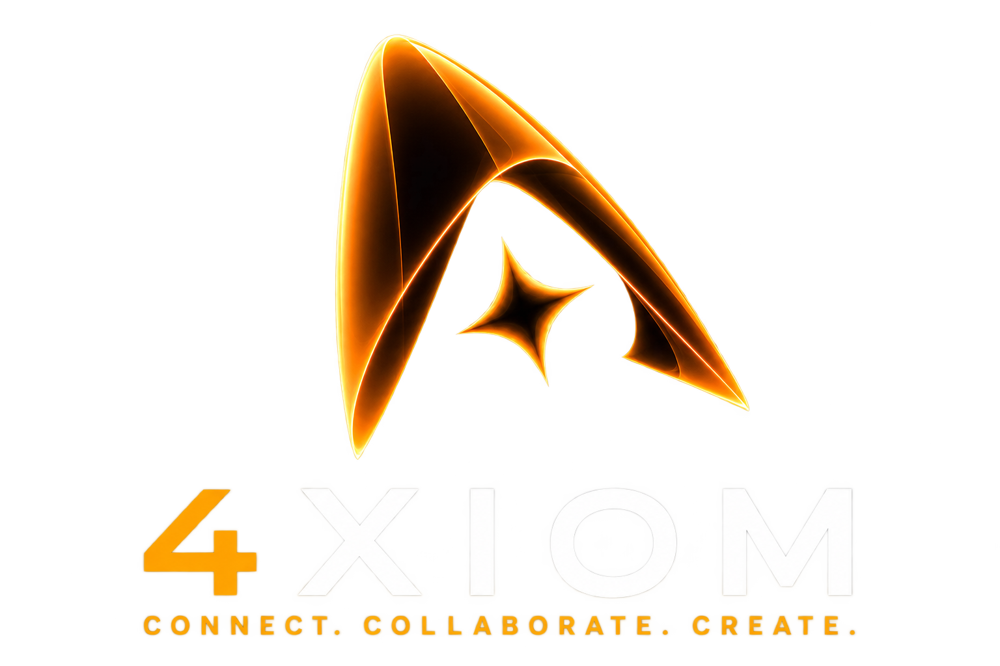

<picture>
  <source media="(prefers-color-scheme: dark)" srcset="https://raw.githubusercontent.com/paragchaudharyy/paragchaudharyy/main/dark.svg">
  <source media="(prefers-color-scheme: light)" srcset="https://raw.githubusercontent.com/paragchaudharyy/paragchaudharyy/main/light.svg">
  
</picture>

  

 

 
 

  

 

  

 

<h2 align="center" style="font-weight:800;">ABOUT ME</h2>

BUILDER · SPEAKER · COMMUNITY BUILDER · DESIGNER

<table width="92%" align="center" border="2" cellpadding="24" cellspacing="0">
<tr>
<td width="68%" valign="middle">

<h3>Hey there, I'm Parag Chaudhary 👋</h3>

I'm a <strong>builder, speaker, community builder and designer</strong> working at the intersection of technology, people and experiences.

I turn ideas into <strong>products, communities and opportunities</strong> — from AI-powered applications and full-stack experiments to student ecosystems, hackathons and technical events.

Currently building, learning and shipping across <strong>AI, full-stack development, systems, design and community-led technology</strong>.

 

<table cellpadding="6" cellspacing="0">
<tr>
<td align="center">

</td>
<td><strong>Top 10 Student Ambassador</strong> @ Google</td>
<td width="18"></td>
<td align="center">

</td>
<td><strong>Founder</strong> @4XIOM</td>
<td width="18"></td>
<td align="center">

</td>
<td><strong>Mentor</strong> @ Unstop</td>
</tr>
</table>

</td>

<td width="32%" align="center" valign="middle">

  

</td>
</tr>
</table>

 

<h2 align="center">TECH STACK</h2>

THE TOOLS I BUILD WITH

&nbsp;
&nbsp;
&nbsp;

 

<h2 align="center">FEATURED BUILDS</h2>

SELECTED WORK · PRODUCTS · SYSTEMS · EXPERIMENTS

<table width="92%" align="center" cellpadding="22" cellspacing="0" border="2">
<tr>
<td width="50%" valign="top">

<strong>01 / AI · OPTIMIZATION · RAILWAYS</strong>

<h2>TrackSync AI</h2>

<strong>Automatic block planning for Indian Railways.</strong> 
A data-driven planning system that combines ETL and Bronze → Silver → Gold processing with constraint-based optimization for asset availability.

<strong>TECH</strong>

<strong>CP-SAT · REST API · Axios · Pydantic</strong>

</td>

<td width="50%" valign="top">

<strong>02 / CYBERSECURITY · INVESTIGATION</strong>

<h2>TFORCE LABS</h2>

<strong>Training & forensics for operational response.</strong> 
A cybersecurity investigation training platform built around realistic law-enforcement workflows and forensic response scenarios.

<strong>TECH</strong>

</td>
</tr>

<tr>
<td width="50%" valign="top">

<strong>03 / AI · SUSTAINABILITY · LCA</strong>

<h2>EcoMetrix</h2>

<strong>AI-powered life-cycle assessment.</strong> 
A sustainability tool designed to quantify and visualize the environmental footprint of industrial materials.

<strong>TECH</strong>

</td>

<td width="50%" valign="top">

<strong>04 / PYTHON · NLP · SIMILARITY</strong>

<h2>AI Resume Skill Analyzer</h2>

<strong>Resume-to-role skill intelligence.</strong> 
Matches resumes against selected roles using TF-IDF, cosine similarity and skill coverage, with actionable skill recommendations.

<strong>TECH</strong>

</td>
</tr>
</table>
 

<h2 align="center" style="font-weight:800;">GITHUB ANALYTICS</h2>

STREAK · PROFILE STATS · LANGUAGE MIX

<table width="92%" align="center" cellpadding="8">
<tr>
<td width="50%" align="center">

</td>
<td width="50%" align="center">

</td>
</tr>
</table>

 

<h2 align="center" style="font-weight:800;">CONTRIBUTION ACTIVITY</h2>

REAL GITHUB CONTRIBUTION DATA · LAST 90 DAYS

 

<h2 align="center" style="font-weight:800;">CONTRIBUTION SNAKE</h2>

REAL CONTRIBUTION GRID · CYAN SNAKE · PURPLE INTENSITY

<picture>
  <source media="(prefers-color-scheme: dark)" srcset="https://raw.githubusercontent.com/paragchaudharyy/paragchaudharyy/output/github-snake-dark.gif">
  <source media="(prefers-color-scheme: light)" srcset="https://raw.githubusercontent.com/paragchaudharyy/paragchaudharyy/output/github-snake-light.gif">
  
</picture>

 

<h2 align="center" style="font-weight:800;">LET'S CONNECT</h2>

<strong>Open to speaking, hackathons, community partnerships, student initiatives and AI projects.</strong>

&nbsp;&nbsp;
&nbsp;&nbsp;

  

 Building in public, one project at a time.

