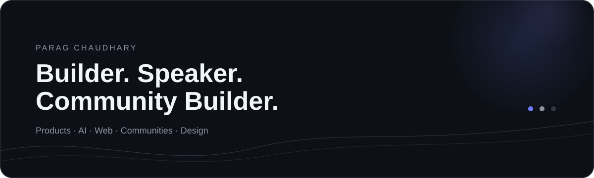

# PARAG CHAUDHARY

<p align="center">
  
</p>

<p align="center">
  <b>Top 10 S.A. @ Google</b> · <b>Founder @4XIOM</b> · <b>Mentor @Unstop</b>
</p>

<p align="center">
  <a href="https://www.linkedin.com/in/paragchaudharyy">LinkedIn</a>
  ·
  <a href="https://github.com/paragchaudharyy">GitHub</a>
  ·
  <a href="https://linktr.ee/paragchaudharyy">Linktree</a>
  ·
  <a href="mailto:paragchaudhary2008@gmail.com">Email</a>
</p>

---

## / SIGNAL

<p align="center">
  
</p>

---

## / WHAT I BUILD

I work at the intersection of **technology, design, communities and people**.

- **Products** — modern web applications, AI-powered tools and experiments
- **Communities** — student ecosystems, partnerships and technical events
- **Experiences** — hackathons, workshops, speaking sessions and design
- **People** — mentoring developers, student founders and hackathon teams

---

## / SELECTED WORK

### TrackSync AI
AI-powered block planning for railway operations, combining structured data processing with optimization.

`React` · `Python` · `FastAPI` · `PostgreSQL` · `CP-SAT`

### TFORCE LABS
A cybersecurity investigation training platform built around realistic law-enforcement workflows.

`Next.js` · `React` · `Tailwind CSS` · `REST APIs`

### EcoMetrix
An AI-powered sustainability platform designed to quantify and visualize the environmental footprint of industrial materials.

`AI` · `Web` · `UI/UX`

### AI Resume Skill Analyzer
A Python + Streamlit project that compares resume skills against a selected role using TF-IDF, cosine similarity and skill coverage.

`Python` · `Streamlit` · `TF-IDF`

---

## / STACK

**Languages**  
Python · JavaScript · TypeScript · C · SQL

**Frontend**  
React · Next.js · Vite · Tailwind CSS

**Backend & APIs**  
Node.js · FastAPI · REST APIs

**Data**  
PostgreSQL · MySQL

**Tools**  
Git · GitHub · VS Code · Figma · Canva

**AI / Cybersecurity**  
Generative AI · Prompt Engineering · OSINT · Digital Forensics

---

## / EXPERIENCE

**Google** — Top 10 S.A. @ Google  
2026 → Present

**4XIOM** — Founder  
2026 → Present

**Unstop** — Mentor  
2026 → Present

**Geek Room JIMS** — Design Lead  
2025 → Present

**GPCSSI** — Cyber Warrior  
2026

---

## / BEYOND CODE

**Speaker** — technology, AI, innovation and student leadership  
**Community Builder** — student ecosystems, partnerships and events  
**Mentor** — students, developers and hackathon teams  
**Designer** — visual systems, event experiences and digital content  
**Hackathon** — Judge · Mentor · Winner

---

## / CURRENTLY

```text
building      →  products, communities & experiments
learning      →  AI, full-stack development & systems
exploring     →  new ways to make technology more accessible
```

---

## / LET'S BUILD SOMETHING

I'm open to **speaking engagements, hackathons, community partnerships,
student initiatives, AI projects and meaningful collaborations.**

<p align="center">
  <a href="https://www.linkedin.com/in/paragchaudharyy">LinkedIn ↗</a>
  &nbsp;&nbsp;·&nbsp;&nbsp;
  <a href="https://linktr.ee/paragchaudharyy">Linktree ↗</a>
  &nbsp;&nbsp;·&nbsp;&nbsp;
  <a href="mailto:paragchaudhary2008@gmail.com">Email ↗</a>
</p>

<p align="center">
  <sub>Building in public, one project at a time.</sub>
</p>
